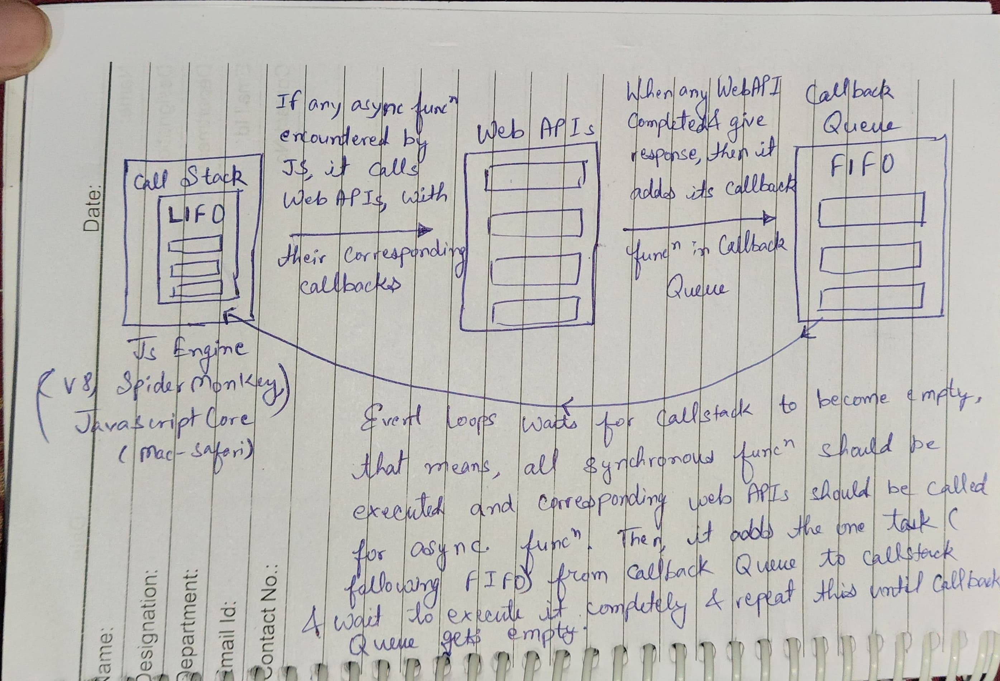

# How JavaScript’s Asynchronous Operations Work in the Browser

The article explains how JavaScript handles asynchronous operations even though it's single-threaded. Here's a summary for revision:

**Key Concepts**

* **Single-threaded:** JavaScript can only execute one instruction at a time.
* **Non-blocking:** JavaScript doesn't wait for slow operations to finish before moving on.
* **Asynchronous:** JavaScript can handle multiple tasks that appear to run at the same time.

**Analogy: Event Planning Companies**

* Lerdorf Corp (multi-threaded): Large company with many departments for tasks.
* Eich Agency (single-threaded): Small company with limited staff, uses external vendors.

**JavaScript Engine and Call Stack**

* JavaScript engine interprets and executes code.
* Call stack keeps track of functions being executed. (LIFO - Last In First Out)

**Asynchronous Operations and Web APIs**

What is an API: An API, or application programming interface, is a set of rules or protocols that enables software applications to communicate with each other to exchange data, features and functionality.

* When JavaScript encounters slow tasks (like fetching data), it uses Web APIs (browser functions) to handle them.
* These tasks are asynchronous and don't block the main thread.

**Callbacks and Callback Queue**

* Web APIs use callbacks (functions) to receive results from asynchronous tasks.
* Callbacks are placed in a queue (FIFO - First In First Out) until the main thread is free.

**Event Loop**

* Continuously monitors the call stack and callback queue.
* If the call stack is empty, the event loop moves a callback from the queue to the call stack for execution.

**Conclusion**

* JavaScript achieves asynchronous behavior by using callbacks, queue, and event loop despite being single-threaded.
* This allows web pages to feel responsive even when waiting for data.

