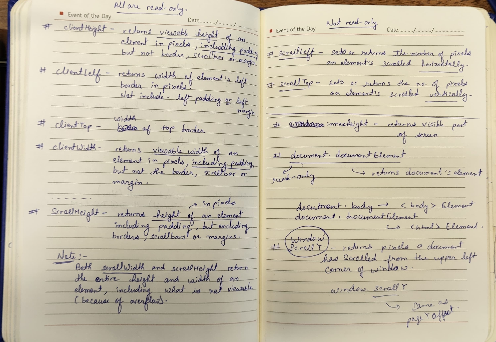

# Infinite Scrolling




Certainly! Here are the notes comparing the two approaches for implementing infinite scroll, including code snippets:

Approach 1: Scrolling within a div

1. HTML structure:
```html
<div id="image-container">
  <!-- Images loaded here -->
</div>
<div id="loading">Loading...</div>
```

2. CSS:
```css
#image-container {
  height: 400px;
  overflow-y: scroll;
}
.image-item {
  width: 100%;
  height: 200px;
  margin-bottom: 10px;
}
#loading {
  display: none;
  text-align: center;
}
```

3. JavaScript:
```javascript
const imageContainer = document.getElementById('image-container');
const loadingElement = document.getElementById('loading');
let page = 1;
const imagesPerPage = 10;
let isLoading = false;

function loadImages() {
  if (isLoading) return;
  isLoading = true;
  loadingElement.style.display = 'block';

  // Simulate loading images
  setTimeout(() => {
    for (let i = 0; i < imagesPerPage; i++) {
      const imageItem = document.createElement('div');
      imageItem.className = 'image-item';
      imageItem.textContent = `Image ${(page - 1) * imagesPerPage + i + 1}`;
      imageContainer.appendChild(imageItem);
    }
    page++;
    isLoading = false;
    loadingElement.style.display = 'none';
  }, 1000);
}

imageContainer.addEventListener('scroll', () => {
  if (imageContainer.scrollTop + imageContainer.clientHeight >= imageContainer.scrollHeight - 20) {
    loadImages();
  }
});

loadImages(); // Initial load
```

Key points:
- Scrolling is contained within a div
- Uses `scrollTop`, `clientHeight`, and `scrollHeight` of the container
- Loads images when scrolling near the bottom of the container

Approach 2: Scrolling the entire page

1. HTML structure:
```html
<div class="container">
  <!-- Images loaded here -->
</div>
```

2. CSS:
```css
.container {
  display: flex;
  flex-wrap: wrap;
}
img {
  margin: 5px;
  width: 200px;
  height: 200px;
}
```

3. JavaScript:
```javascript
const container = document.querySelector('.container');

function loadImages(numImages = 10) {
  let i = 0;
  while (i < numImages) {
    fetch('https://dog.ceo/api/breeds/image/random')
      .then(response => response.json())
      .then(data => {
        const img = document.createElement('img');
        img.src = data.message;
        container.appendChild(img);
      });
    i++;
  }
}

window.addEventListener('scroll', () => {
  if (window.scrollY + window.innerHeight >= 
      document.documentElement.scrollHeight) {
    loadImages();
  }
});

loadImages(); // Initial load
```

Key points:
- Scrolling applies to the entire page
- Uses `window.scrollY`, `window.innerHeight`, and `document.documentElement.scrollHeight`
- Loads images when reaching the bottom of the page
- Fetches images from an API (Dog API in this example)

Main differences:
1. Scroll area: Approach 1 scrolls within a div, while Approach 2 scrolls the entire page.
2. Image source: Approach 1 simulates image loading, while Approach 2 fetches real images from an API.
3. Scroll detection: Approach 1 uses container properties, while Approach 2 uses window and document properties.
4. Layout: Approach 1 stacks images vertically, while Approach 2 uses a flex layout.

Both approaches demonstrate the core concept of infinite scrolling: detecting when the user has scrolled to the bottom (or near-bottom) of the content area and then loading more content in response.